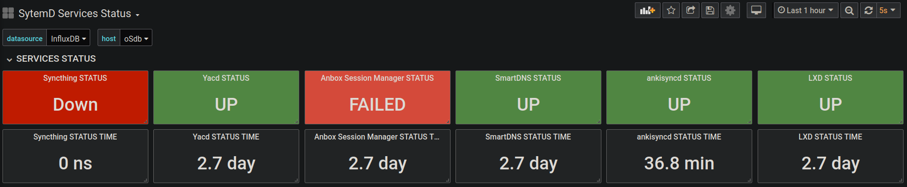

# SRVSTATUS

A bash script to help you get systemd services status with Telegraf + InfluxDB + Grafana

Support **system systemd services** and **user systemd services**

It use some cli tool to get info from `systemctl` invoke, output the info use *InfluxDB line protocal* format



## Requirements
* bash > 4.0 (because of `mapfile` use, you can also follow [this](https://github.com/koalaman/shellcheck/wiki/SC2207#correct-code) changing this script for lower version bash 
* coreutils (for `date, tr`
* sed

Your need install Telegraf + InfluxDB + Grafana before use this script.

## Install
### A maybe proper practice
```bash
mkdir -p ~/.config/user_telegraf_plugin/shell
cd ~/.config/user_telegraf_plugin/shell
git clone https://github.com/zzndb/srvstatus
cd srvstatus
chmod +x srvstatus.sh
```
Add your needed system service name into `service_list` file, one name per line.

Then configure the Telegraf `[[inputs.exec]]` section like this:
```conf
[[inputs.exec]]
  commands = [
    "/home/your_user_name/.config/user_telegraf_plugin/shell/srvstatus/srvstatus.sh"
  ]

  timeout = "5s"
  data_format = "influx"

```

Use https://grafana.com/dashboards/8348 Grafana dashboard json file, thanks @ratibor78 work

#### more for user systemd service
If you also want to use this with your user systemd service
* create `user_service_list` file
* add user the service name into `user_service_list`, also one name per line.
* **change the script**
    * change `Uid=1000` into your user id, you can get your user id use `id --user` in your terminal


## Test
```bash
telegraf --input-filter exec --test
```
Maybe your also need test with sudo
```bash
sudo telegraf --input-filter exec --test
```

more info you can check `srvstatus.sh` file

## Thanks
* [srvstatus](https://github.com/ratibor78/srvstatus) the original python version
